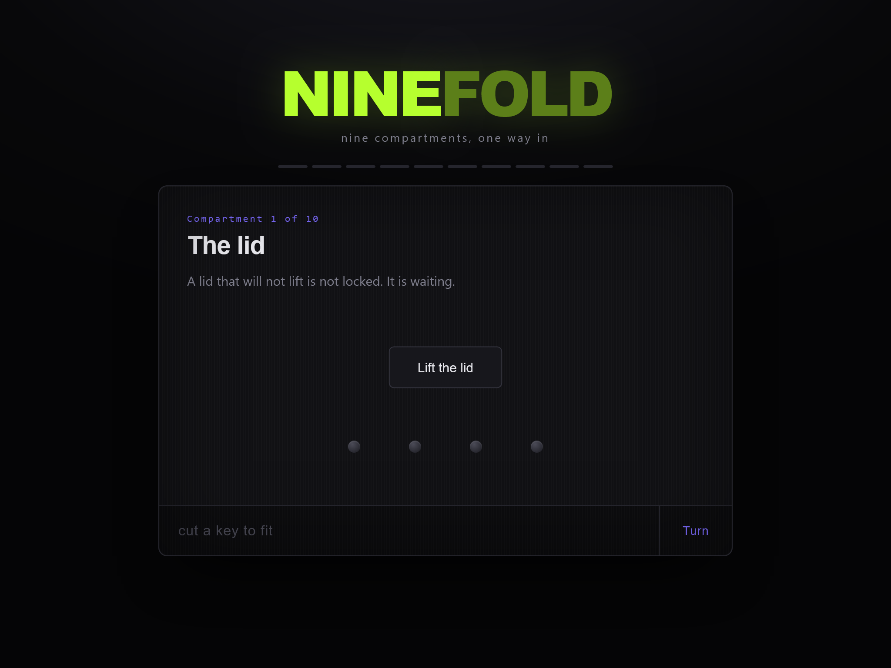

# NINEFOLD

A single-file, client-side puzzle box. No backend, no network calls, no
tracking — open `index.html` in a browser and that's the whole app.



## Play

Open [`index.html`](https://shanemc92.github.io/ninefold-ctf/index.html). Nine compartments stand between
you and the flag. Each one is a different physical trick — nothing is
explained up front, and nothing about how a compartment works is visible in
the page source until you've actually opened it.

Works on desktop and mobile (touch included).

> There's more in this box than the nine compartments suggest. Worth taking
> a proper look once the lid comes off.

**If you're enjoying it: stop here, don't open `builders/` or `solvers/`.**
Those folders contain every answer in plaintext. They exist so the project
is reproducible, not so you can peek — opening them will spoil the box.

## How it's protected

Nothing client-side is ever fully secure — it's all just bytes in your
browser. So rather than pretend otherwise, each stage's markup and logic
here is AES-256-GCM encrypted, with the decryption key derived (PBKDF2-
HMAC-SHA256) from the answer to the *previous* stage. Practically, that
means:

- Nothing beyond the compartment you're currently on exists in readable
  form anywhere in the file — view-source won't help you skip ahead.
- A wrong answer is a failed authenticated decryption, not a failed
  `if (guess === answer)` — there's no comparison to patch around.

## Repo layout

```
index.html    the built game — this is the only file you need to play
builders/          generates index.html from the puzzle definitions
solvers/           reference solver(s), used to prove each stage is solvable
docs/              screenshot(s) for this README
```

`builders/` and `solvers/` contain the actual puzzle answers and solving
logic in plaintext, as noted above — leave them closed until you're done.

## Building it yourself

```
pip install cryptography
python3 builders/build.py
```

Regenerates `index.html` at the repo root from the definitions in
`builders/`.

## License

MIT — see [LICENSE](LICENSE).
